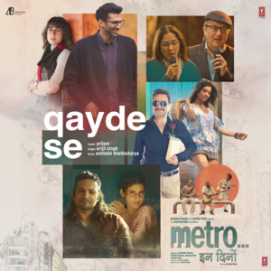

<!DOCTYPE html>
<html lang="en">
    <head>
        <meta charset="UTF-8" />
        <meta name="viewport" content="width=device-width, initial-scale=1.0" />
        <title>Spotify Clone</title>
        <link rel="stylesheet" href="./src/output.css" />
    </head>
    <body class="text-white bg-black">

        <!-- NAVBAR -->
        

    <!-- LEFT SECTION -->
    

        <!-- Logo -->
        

            
        

        <!-- Home Button -->
        

            
        

        <!-- Searchbar -->
        

            
            <input type="text" placeholder="What do you want to play?!"
                class="bg-transparent text-white px-4 py-2 w-[300px] font-semibold border-none focus:outline-none placeholder:text-sm" />
            
            
        

    

    <!-- RIGHT SECTION -->
    

        <!-- Options -->
        

            <button class="hover:scale-105 transition">Premium</button>
            <button class="hover:scale-105 transition">Support</button>
            <button class="hover:scale-105 transition">Download</button>
        

        <!-- Divider -->
        

        <!-- Install App -->
        

            
            <button>Install App</button>
        

        <!-- Sign Up & Login -->
        <button class="signup hover:scale-105 transition">Sign Up</button>
        <button class="login bg-white text-black rounded-full px-5 py-2 font-bold hover:scale-110 transition-all duration-500 ease-in">
            Login
        </button>
    

    

        

        <!-- MAIN -->
        <main class="flex">
            <!-- LEFT SIDEBAR -->
            <aside
                class="w-[30vw] h-[87vh] m-2 bg-lightblack rounded-lg sticky">
                

                    Your Library
                    
                

                

                    

                        Create Your First
                            Playlist
                        It’s easy, we’ll help you
                    

                    <button
                        class="w-[150px] bg-white text-black rounded-full py-2 m-1 font-bold hover:scale-110 transition-all duration-500 ease-in">Create
                        Playlist</button>
                

                

                    

                        Let’s find some podcasts to
                            follow
                        We’ll keep you updated on new episodes
                    

                    <button
                        class="w-[150px] bg-white text-black rounded-full py-2 m-1 font-bold hover:scale-110 transition-all duration-500 ease-in">Browse
                        Podcasts</button>
                

                

                    Legal
                    Safety & Privacy Centre
                    Privacy Policies
                    Cookies
                    About Ads
                    Accessibility
                

                

                    
                    <button>English</button>
                

            </aside>

            <!-- RIGHT SECTION -->
            <section
                class="w-[70vw] h-[87vh] m-2 bg-lightblack rounded-lg overflow-y-auto scrollbar-hide">
                

                    

                        <h2
                            class="font-bold text-2xl cursor-pointer hover:underline">Trending
                            Songs</h2>
                        <button
                            class="text-sm hover:underline cursor-pointer">Show
                            All</button>
                    

                    

                        <!-- SONG CARDS GO HERE -->
                        

                            
                            <!-- Play Button: Hidden by default, visible on hover -->
                            <button
                                class="circle opacity-0 group-hover:opacity-100 transition-opacity duration-300 flex justify-center items-center h-12 w-12 bg-green-600 rounded-full absolute top-[110px] right-0 m-5 p-3">
                                
                            </button>

                            
                                Sahiba
                            
                            
                                Aditya Rikhari
                            
                        

                        

                            
                            <!-- Play Button: Hidden by default, visible on hover -->
                            <button
                                class="circle opacity-0 group-hover:opacity-100 transition-opacity duration-300 flex justify-center items-center h-12 w-12 bg-green-600 rounded-full absolute top-[110px] right-0 m-5 p-3">
                                
                            </button>

                            
                                At Peace
                            
                            
                                Aditya Rikhari
                            
                        

                        

                            
                            <!-- Play Button: Hidden by default, visible on hover -->
                            <button
                                class="circle opacity-0 group-hover:opacity-100 transition-opacity duration-300 flex justify-center items-center h-12 w-12 bg-green-600 rounded-full absolute top-[110px] right-0 m-5 p-3">
                                
                            </button>

                            
                                Dhun
                            
                            
                                Aditya Rikhari
                            
                        

                        

                            
                            <!-- Play Button: Hidden by default, visible on hover -->
                            <button
                                class="circle opacity-0 group-hover:opacity-100 transition-opacity duration-300 flex justify-center items-center h-12 w-12 bg-green-600 rounded-full absolute top-[110px] right-0 m-5 p-3">
                                
                            </button>

                            
                                Gulaabi Ankhein
                            
                            
                                Aditya Rikhari
                            
                        

                        

                            
                            <!-- Play Button: Hidden by default, visible on hover -->
                            <button
                                class="circle opacity-0 group-hover:opacity-100 transition-opacity duration-300 flex justify-center items-center h-12 w-12 bg-green-600 rounded-full absolute top-[110px] right-0 m-5 p-3">
                                
                            </button>

                            
                                Ishq Bawla
                            
                            
                                Aditya Rikhari
                            
                        

                        

                            
                            <!-- Play Button: Hidden by default, visible on hover -->
                            <button
                                class="circle opacity-0 group-hover:opacity-100 transition-opacity duration-300 flex justify-center items-center h-12 w-12 bg-green-600 rounded-full absolute top-[110px] right-0 m-5 p-3">
                                
                            </button>

                            
                                Qayde Se
                            
                            
                                Aditya Rikhari
                            
                        

                    

                

            

            

                

                    <h2
                        class="font-bold text-2xl cursor-pointer hover:underline">Popular
                        Artists</h2>
                    <button class="text-sm hover:underline cursor-pointer">Show
                        All</button>
                

                

                    <!-- ARTIST CARDS GO HERE -->
                    

                        <!-- Artist Card -->
                        

                            
                            <!-- Play Button: Hidden by default, visible on hover -->
                            <button
                                class="circle opacity-0 group-hover:opacity-100 transition-opacity duration-300 flex justify-center items-center h-12 w-12 bg-green-600 rounded-full absolute top-[100px] right-0 m-5 p-3">
                                
                            </button>

                            
                                Anirudh Ravichander
                            
                            
                                Artist
                            
                        

                        

                            
                            <!-- Play Button: Hidden by default, visible on hover -->
                            <button
                                class="circle opacity-0 group-hover:opacity-100 transition-opacity duration-300 flex justify-center items-center h-12 w-12 bg-green-600 rounded-full absolute top-[100px] right-0 m-5 p-3">
                                
                            </button>

                            
                                A.R.Rahman
                            
                            
                                Artist
                            
                        

                        

                            
                            <!-- Play Button: Hidden by default, visible on hover -->
                            <button
                                class="circle opacity-0 group-hover:opacity-100 transition-opacity duration-300 flex justify-center items-center h-12 w-12 bg-green-600 rounded-full absolute top-[100px] right-0 m-5 p-3">
                                
                            </button>

                            
                                Arijit Singh
                            
                            
                                Artist
                            
                        

                        

                            
                            <!-- Play Button: Hidden by default, visible on hover -->
                            <button
                                class="circle opacity-0 group-hover:opacity-100 transition-opacity duration-300 flex justify-center items-center h-12 w-12 bg-green-600 rounded-full absolute top-[100px] right-0 m-5 p-3">
                                
                            </button>

                            
                                Atif Aslam
                            
                            
                                Artist
                            
                        

                        

                            
                            <!-- Play Button: Hidden by default, visible on hover -->
                            <button
                                class="circle opacity-0 group-hover:opacity-100 transition-opacity duration-300 flex justify-center items-center h-12 w-12 bg-green-600 rounded-full absolute top-[100px] right-0 m-5 p-3">
                                
                            </button>

                            
                                Pritam
                            
                            
                                Artist
                            
                        

                        

                            
                            <!-- Play Button: Hidden by default, visible on hover -->
                            <button
                                class="circle opacity-0 group-hover:opacity-100 transition-opacity duration-300 flex justify-center items-center h-12 w-12 bg-green-600 rounded-full absolute top-[100px] right-0 m-5 p-3">
                                
                            </button>

                            
                                Sachin-Jigar
                            
                            
                                Artist
                            
                        

                    

                

                

                    

                        <button
                            class="font-bold text-2xl hover:cursor-pointer hover:underline">Popular
                            Albums And Singles</button>
                        <button
                            class="text-sm hover:cursor-pointer hover:underline">Show
                            All</button>
                    

                    

                        

                            
                            <button
                                class="circle opacity-0 group-hover:opacity-100 transition-opacity duration-300 flex justify-center items-center h-12 w-12 bg-green-600 rounded-full absolute top-[110px] right-0 m-5 p-3">
                                
                            </button>
                            Aashiqui
                                2
                            Mithoon,
                                Ankit Tiwari, Jeet Ganguuli
                        

                        

                            
                            <button
                                class="circle opacity-0 group-hover:opacity-100 transition-opacity duration-300 flex justify-center items-center h-12 w-12 bg-green-600 rounded-full absolute top-[110px] right-0 m-5 p-3">
                                
                            </button>
                            Yeh
                                Jawaani Hai Deewani
                            Pritam
                        

                        

                            
                            <button
                                class="circle opacity-0 group-hover:opacity-100 transition-opacity duration-300 flex justify-center items-center h-12 w-12 bg-green-600 rounded-full absolute top-[110px] right-0 m-5 p-3">
                                
                            </button>
                            Sanam
                                Teri Kasam
                            Himesh
                                Reshammiya,Sameer Anjaan
                        

                        

                            
                            <button
                                class="circle opacity-0 group-hover:opacity-100 transition-opacity duration-300 flex justify-center items-center h-12 w-12 bg-green-600 rounded-full absolute top-[110px] right-0 m-5 p-3">
                                
                            </button>
                            Finding
                                her
                            Kushagra,Bharath,Saaheal
                        

                        

                            
                            <button
                                class="circle opacity-0 group-hover:opacity-100 transition-opacity duration-300 flex justify-center items-center h-12 w-12 bg-green-600 rounded-full absolute top-[110px] right-0 m-5 p-3">
                                
                            </button>
                            Young
                                G.O.A.T
                            Cheema
                                Y, Gur Seedhu
                        

                        

                            
                            <button
                                class="circle opacity-0 group-hover:opacity-100 transition-opacity duration-300 flex justify-center items-center h-12 w-12 bg-green-600 rounded-full absolute top-[110px] right-0 m-5 p-3">
                                
                            </button>
                            Making
                                Memories
                            Karan
                                Aujla, Ikky
                        

                    

                

                

                <footer class="flex m-5 p-5 h-[15vw] justify-around">
                    

                        Company
                        About
                        Jobs
                        For
                            The Record
                    

                    

                        Communities
                        For
                            Artists
                        Developers
                        Advertising
                        Investors
                        Vendors
                    

                    

                        Useful Links
                        Support
                        Free
                            Mobile App
                        Popular
                            By Country
                    

                    

                        Spotify Plans
                        Premium
                            Individual
                        Premium
                            Duo
                        Premium
                            Family
                        Premium
                            Student
                        Spotify
                            Free
                    

                    

                        

                            
                        

                        

                            
                        

                        

                            
                        

                    

                </footer>
                

                <footer class="m-5 p-5">
                    &copy; 2025 Spotify AB
                </footer>
